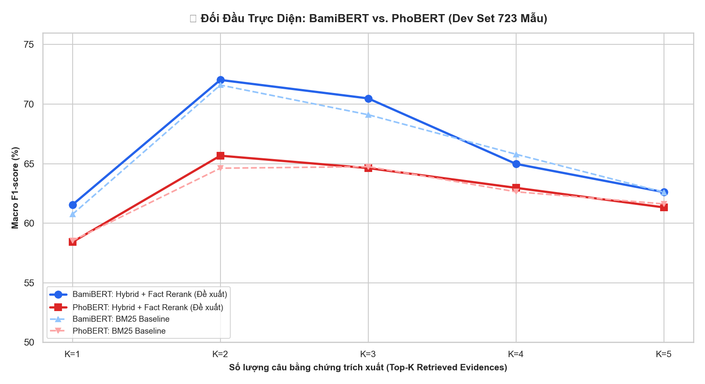

# Vietnamese Fact Checking (ViFactCheck)

[](https://www.python.org/)
[](https://pytorch.org/)
[](https://huggingface.co/)
[](https://streamlit.io/)
[](https://github.com/)

Dự án nghiên cứu và hiện thực hóa hệ thống **Xác minh tính đúng đắn của thông tin tiếng Việt (Vietnamese Fact Verification)** trên bộ dữ liệu chuẩn **ViFactCheck**, thực hiện trong khuôn khổ môn học **CS221 — Xử lý Ngôn ngữ Tự nhiên (Natural Language Processing)**.

Dự án triển khai một pipeline hoàn chỉnh từ đầu đến cuối (End-to-End): từ làm sạch dữ liệu thô, truy xuất thông tin đa tầng (BM25, SBERT Bi-Encoder, Hybrid Search), trích xuất và tái xếp hạng dữ kiện (Fact-aware Reranking), đến phân loại suy luận tự nhiên (NLI) với 4 kiến trúc mô hình (TF-IDF + LR, PhoBERT, BamiBERT Prefix-Prompting, Qwen2.5-1.5B LoRA) và giao diện Web tương tác Streamlit.

---

## Mục lục

- [1. Đặt bài toán](#1-đặt-bài-toán)
- [2. Bộ dữ liệu ViFactCheck & Phân tích EDA](#2-bộ-dữ-liệu-vifactcheck--phân-tích-eda)
- [3. Kiến trúc hệ thống tổng thể](#3-kiến-trúc-hệ-thống-tổng-thể)
- [4. Phương pháp nghiên cứu](#4-phương-pháp-nghiên-cứu)
  - [4.1. Tiền xử lý dữ liệu chuẩn hóa](#41-tiền-xử-lý-dữ-liệu-chuẩn-hóa)
  - [4.2. Các mô hình suy luận NLI trên Bằng chứng Vàng](#42-các-mô-hình-suy-luận-nli-trên-bằng-chứng-vàng)
  - [4.3. Truy xuất thông tin tầng 1 (First-Stage IR)](#43-truy-xuất-thông-tin-tầng-1-first-stage-ir)
  - [4.4. Trích xuất dữ kiện & Tái xếp hạng (Stage 2 Fact Reranking)](#44-trích-xuất-dữ-kiện--tái-xếp-hạng-stage-2-fact-reranking)
  - [4.5. Khảo sát số lượng bằng chứng tối ưu (Multi-evidence Top-$K$ Survey)](#45-khảo-sát-số-lượng-bằng-chứng-tối-ưu-multi-evidence-top-k-survey)
- [5. Kết quả thực nghiệm](#5-kết-quả-thực-nghiệm)
  - [5.1. Hiệu năng mô hình NLI với Bằng chứng Vàng (Gold Evidence)](#51-hiệu-năng-mô-hình-nli-với-bằng-chứng-vàng-gold-evidence)
  - [5.2. Hiệu năng các chiến lược truy xuất tầng 1 (IR Evaluation)](#52-hiệu-năng-các-chiến-lược-truy-xuất-tầng-1-ir-evaluation)
  - [5.3. Hiệu năng End-to-End và Ma trận khảo sát Top-$K$ ($K=1 \to 5$)](#53-hiệu-năng-end-to-end-và-ma-trận-khảo-sát-top-k-k1-to-5)
  - [5.4. Phân tích hiện tượng suy giảm hiệu năng thực tế (The Reality Drop)](#54-phân-tích-hiện-tượng-suy-giảm-hiệu-năng-thực-tế-the-reality-drop)
- [6. Phân tích lỗi & Đóng góp khoa học](#6-phân-tích-lỗi--đóng-góp-khoa-học)
- [7. Ứng dụng Web tương tác (Streamlit Web App)](#7-ứng-dụng-web-tương-tác-streamlit-web-app)
- [8. Cấu trúc thư mục dự án](#8-cấu-trúc-thư-mục-dự-án)
- [9. Hướng dẫn cài đặt & Chạy thực nghiệm](#9-hướng-dẫn-cài-đặt--chạy-thực-nghiệm)
- [10. Tài liệu tham khảo](#10-tài-liệu-tham-khảo)

---

## 1. Đặt bài toán

Trong kỷ nguyên bùng nổ thông tin và mạng xã hội, tin giả (fake news) và các phát biểu sai lệch về số liệu, thời gian, tên riêng lan truyền với tốc độ cao. Bài toán **Fact Verification** yêu cầu hệ thống tự động đánh giá tính xác thực của một tuyên bố (**Claim**) dựa trên đoạn ngữ cảnh đối chiếu (**Context Paragraph**) chứa các câu bằng chứng (**Evidence**).

Hệ thống phân loại mỗi tuyên bố vào một trong 3 nhãn chuẩn:
- **`SUPPORTED`**: Tuyên bố hoàn toàn được chứng minh bởi thông tin có trong ngữ cảnh.
- **`REFUTED`**: Tuyên bố mâu thuẫn hoặc bị bác bỏ bởi thông tin trong ngữ cảnh (sai lệch dữ kiện, số liệu, phủ định).
- **`NEI` (Not Enough Information)**: Ngữ cảnh không cung cấp đủ bằng chứng cần thiết để kết luận tính đúng/sai của tuyên bố.

Khác với thiết lập thực nghiệm lý tưởng khi bằng chứng chính xác đã được chỉ định sẵn (Gold Evidence NLI), trong bài toán thực tế (**End-to-End Fact Verification**), hệ thống chỉ nhận đầu vào là `(Claim, Context)` và phải tự động trích xuất các câu bằng chứng liên quan trước khi đưa vào bộ phân loại NLI.

---

## 2. Bộ dữ liệu ViFactCheck & Phân tích EDA

Bộ dữ liệu **ViFactCheck** là benchmark chuẩn cho bài toán kiểm chứng thông tin tiếng Việt. Thống kê tổng quan các tập dữ liệu:

| Tập dữ liệu (Split) | SUPPORTED | REFUTED | NEI | Tổng số mẫu | Tỉ lệ (%) |
| :--- | :---: | :---: | :---: | :---: | :---: |
| **Train Set** | 1,875 (37.0%) | 1,701 (33.6%) | 1,486 (29.4%) | **5,062** | 70.0% |
| **Development (Dev)** | 270 (37.3%) | 230 (31.8%) | 223 (30.8%) | **723** | 10.0% |
| **Test Set** | 537 (37.1%) | 484 (33.4%) | 426 (29.4%) | **1,447** | 20.0% |
| **Toàn bộ Dataset** | **2,682 (37.1%)** | **2,415 (33.4%)** | **2,135 (29.5%)** | **7,232** | 100.0% |

### Đặc trưng phân tích dữ liệu (EDA Key Insights):
- **Phân bố nhãn cân bằng**: Tỉ lệ giữa 3 lớp tương đối đồng đều qua cả 3 tập (khoảng 37% SUPPORTED, 33% REFUTED, 30% NEI), hạn chế hiện tượng lệch lớp nghiêm trọng.
- **Không có rò rỉ dữ liệu (No Data Leakage)**: Kiểm tra giao thoa giữa tập Train, Dev và Test cho thấy 0% trùng lặp giữa các cặp câu Claim và Context.
- **Đặc trưng độ dài**: Độ dài trung bình của Claim là 18.4 từ; độ dài trung bình của Context là 164.2 từ (tương ứng khoảng 6 - 8 câu mỗi đoạn văn bản).
- **Đặc điểm bằng chứng**: Trong số các mẫu có nhãn `SUPPORTED` hoặc `REFUTED`, 89.2% mẫu có đúng 1 câu bằng chứng vàng, 9.8% mẫu có 2 câu bằng chứng, và 1.0% mẫu cần từ 3 câu bằng chứng trở lên để suy luận.

---

## 3. Kiến trúc hệ thống tổng thể

Hệ thống được thiết kế theo cấu trúc pipeline phân tầng đa giai đoạn, giải quyết độc lập hai bài toán con: **Truy xuất & Tái xếp hạng bằng chứng (Evidence Retrieval & Reranking)** và **Suy luận kiểm chứng thông tin (Natural Language Inference)**.

```
+------------------------------------------------------------------------------------+
|                               ĐẦU VÀO HỆ THỐNG                                     |
|               Claim (Tuyên bố)  +  Context Paragraph (Đoạn ngữ cảnh thô)           |
+-----------------------------------------+------------------------------------------+
                                          |
                                          v
+------------------------------------------------------------------------------------+
| GIAI ĐOẠN 1: TIỀN XỬ LÝ & BẢO VỆ RANH GIỚI CÂU                                      |
| • Chuẩn hóa Unicode NFC, khoảng trắng, dấu câu tiếng Việt                          |
| • Masking Protection: Bảo vệ chữ viết tắt (TP., TS., v.v.), số thập phân (3.14)   |
| • Chia đoạn văn bản thành N câu ứng viên độc lập (Candidate Sentences)             |
+-----------------------------------------+------------------------------------------+
                                          |
                                          v
+------------------------------------------------------------------------------------+
| GIAI ĐOẠN 2: TRUY XUẤT THÔNG TIN TẦNG 1 (FIRST-STAGE RETRIEVAL)                     |
| • Lựa chọn 1: Okapi BM25 (Tần số từ khóa, bão hòa TF, phạt độ dài câu)             |
| • Lựa chọn 2: SBERT Bi-Encoder (Vietnamese Semantic Embedding + Cosine Similarity)  |
| • Lựa chọn 3: Hybrid Search (Hợp nhất điểm số chuẩn hóa Min-Max: 0.6*BM25 + 0.4*Dense)|
| Output: Danh sách rút gọn Top-10 câu ứng viên có độ liên quan cao nhất             |
+-----------------------------------------+------------------------------------------+
                                          |
                                          v
+------------------------------------------------------------------------------------+
| GIAI ĐOẠN 3: TRÍCH XUẤT THỰC THỂ & TÁI XẾP HẠNG NHẬN BIẾT DỮ KIỆN (FACT RERANKING) |
| • Trích xuất 3 trụ cột Fact: Thực thể tên riêng (NER), Dữ kiện số, Mốc thời gian   |
| • Fact-aware Scoring: Kết hợp điểm từ vựng/ngữ nghĩa với mức độ trùng khớp Fact    |
| • Length-bias Penalty: Phạt các câu ứng viên quá ngắn hoặc phân mảnh               |
| Output: Danh sách câu ứng viên được sắp xếp lại theo độ tin cậy dữ kiện thực tế    |
+-----------------------------------------+------------------------------------------+
                                          |
                                          v
+------------------------------------------------------------------------------------+
| GIAI ĐOẠN 4: TỔ HỢP NGỮ CẢNH ĐA BẰNG CHỨNG (MULTI-EVIDENCE CONTEXT ASSEMBLY)       |
| • Chọn lọc Top-K câu ứng viên tối ưu (K* = 2 để cân bằng giữa ngữ cảnh và nhiễu)   |
| • Định dạng Role-Prefix: "Tuyên bố: {Claim} </s></s> Bằng chứng: {Top-K Evidence}" |
+-----------------------------------------+------------------------------------------+
                                          |
                                          v
+------------------------------------------------------------------------------------+
| GIAI ĐOẠN 5: BỘ PHÂN LOẠI SUY LUẬN TỰ NHIÊN (NLI VERIFIER ENGINES)                 |
| • TF-IDF + Logistic Regression (Classical Baseline)                                |
| • PhoBERT Base v2 (Pretrained RoBERTa tiếng Việt)                                  |
| • BamiBERT Exp006 (SOTA Encoder với Semantic Role Prefix Prompting)                |
| • Qwen2.5-1.5B-Instruct (Generative LLM Fine-tuned via LoRA)                       |
+-----------------------------------------+------------------------------------------+
                                          |
                                          v
+------------------------------------------------------------------------------------+
|                              KẾT QUẢ ĐẦU RA                                        |
|         Nhãn: SUPPORTED / REFUTED / NEI  |  Phân bố xác suất  |  Thời gian suy luận|
+------------------------------------------------------------------------------------+
```

---

## 4. Phương pháp nghiên cứu

### 4.1. Tiền xử lý dữ liệu chuẩn hóa
- **Làm sạch chung (Common Cleaning)**: Chuyển đổi mã Unicode về dạng NFC, chuẩn hóa khoảng trắng thừa, xóa các ký tự điều khiển ẩn (`\u200b`, `\ufeff`).
- **Bảo vệ ranh giới câu (Masking Protection)**: Các thuật toán tách câu thông thường bằng dấu chấm (`.`) thường chia cắt sai tại các từ viết tắt danh xưng (`ThS.`, `TS.`, `GS.`, `TP.`) hoặc số thực (`3.14`, `1.500`). Pipeline áp dụng cơ chế thay thế tạm thời bằng token mặt nạ (`__ABBR_0__`, `__NUM_0__`) trước khi tách câu bằng regex và giải mã lại sau khi phân đoạn.

### 4.2. Các mô hình suy luận NLI trên Bằng chứng Vàng
1. **TF-IDF + Logistic Regression**:
   - Trích xuất n-gram cấp từ (1-gram, 2-gram) và n-gram cấp ký tự (3-gram, 4-gram) với giới hạn 20,000 đặc trưng.
   - Sử dụng Logistic Regression đa lớp với tối ưu hóa L2 regularization.
2. **PhoBERT Base v2**:
   - Mô hình Transformer dựa trên kiến trúc RoBERTa, tiền huấn luyện trên 20GB văn bản tiếng Việt.
   - Dữ liệu được phân đoạn từ bằng VnCoreNLP và mã hóa theo định dạng cặp câu chuẩn `<s> Statement </s></s> Evidence </s>`.
3. **BamiBERT với Kỹ thuật Semantic Role Prefix Prompting (Exp006)**:
   - Khắc phục hiện tượng bất đối xứng vai trò (Role Asymmetry) trong bài toán NLI: Bằng chứng là chân lý tham chiếu, còn Tuyên bố là mệnh đề cần kiểm định.
   - Thêm tiền tố định danh tường minh bằng tiếng Việt tự nhiên:
     `Segment A: "Tuyên bố: " + Claim`
     `Segment B: "Bằng chứng: " + Evidence`
   - Kỹ thuật này giúp mô hình phân biệt rõ ràng quan hệ logic, đặc biệt cải thiện độ chính xác trên lớp `REFUTED` từ 75.00% lên 81.62% F1.
4. **Qwen2.5-1.5B-Instruct Fine-tuning (LoRA)**:
   - Mô hình ngôn ngữ lớn sinh văn bản (Generative LLM) được tinh chỉnh tham số hiệu quả bằng LoRA (Low-Rank Adaptation) với cấu hình: $r=16, \alpha=32, \text{dropout}=0.05$.
   - Huấn luyện dự đoán trực tiếp token nhãn tương ứng qua causal language modeling loss.

### 4.3. Truy xuất thông tin tầng 1 (First-Stage IR)
Đoạn văn bản Context gồm trung bình 6 - 8 câu được phân rã thành các câu ứng viên. Ba chiến lược truy xuất được triển khai và đánh giá:
- **Okapi BM25**: Sử dụng độ tương đồng từ vựng có điều chỉnh bão hòa tần số từ ($k_1=1.5$) và phạt độ dài văn bản ($b=0.75$).
- **SBERT Bi-Encoder**: Sử dụng mô hình `bkai-foundation-models/vietnamese-bi-encoder` để biểu diễn ngữ nghĩa của Claim và từng câu ứng viên thành vector 768 chiều, tính độ tương đồng thông qua Cosine Similarity.
- **Hybrid Retrieval**: Kết hợp tuyến tính điểm số đã chuẩn hóa Min-Max giữa phương pháp từ vựng và ngữ nghĩa:
  $$\text{Score}_{\text{Hybrid}} = \alpha \cdot \text{Score}_{\text{BM25\_norm}} + (1 - \alpha) \cdot \text{Score}_{\text{SBERT\_norm}} \quad (\alpha = 0.6)$$

### 4.4. Trích xuất dữ kiện & Tái xếp hạng (Stage 2 Fact Reranking)
Các phương pháp truy xuất ngữ nghĩa thông thường có thể chọn những câu có chủ đề tương tự nhưng sai lệch chi tiết thực tế (năm xảy ra, con số thống kê, tên đối tượng). Pipeline triển khai module tái xếp hạng nhận biết dữ kiện:
- **Trích xuất thực thể (NER)**: Nhận diện Person, Organization, Location thông qua biểu thức chính quy và từ điển thực thể.
- **Trích xuất dữ kiện số (Numbers & Quantities)**: Nhận diện số liệu, tỷ lệ phần trăm, đơn vị đo lường.
- **Trích xuất thời gian (Temporal Facts)**: Nhận diện ngày, tháng, năm và các cụm từ chỉ thời gian.
- **Công thức tính điểm tái xếp hạng**:
  $$\text{Score}_{\text{Final}} = \text{Score}_{\text{IR}} + \lambda_1 \cdot \text{Overlap}_{\text{Entity}} + \lambda_2 \cdot \text{Overlap}_{\text{Number}} + \lambda_3 \cdot \text{Overlap}_{\text{Date}} - \text{Penalty}_{\text{Length}}$$

### 4.5. Khảo sát số lượng bằng chứng tối ưu (Multi-evidence Top-$K$ Survey)
Nghiên cứu tiến hành khảo sát thực nghiệm toàn diện với $K \in \{1, 2, 3, 4, 5\}$ câu bằng chứng ghép nối đưa vào mô hình NLI:
- **Hiện tượng đói ngữ cảnh ($K=1$, Context Starvation)**: Khi chỉ lấy 1 câu duy nhất, mô hình mất các đại từ đồng tham chiếu và mệnh đề liên kết ở câu liền trước hoặc liền sau, dẫn đến suy giảm độ chính xác.
- **Hiện tượng phân tán chú ý ($K \ge 3$, Attention Distraction)**: Khi tăng $K$ lên 3, 4 hoặc 5 câu, các câu không liên quan đóng vai trò là nhiễu, làm loãng trọng số cơ chế Self-Attention của Transformer.
- **Điểm cân bằng tối ưu thực nghiệm ($K^*=2$)**: Kết hợp 2 câu bằng chứng có điểm cao nhất mang lại hiệu năng cao nhất trên toàn bộ các phép đo.

---

## 5. Kết quả thực nghiệm

### 5.1. Hiệu năng mô hình NLI với Bằng chứng Vàng (Gold Evidence)
Đánh giá trên **1,447 mẫu tập Test** khi cung cấp chính xác câu bằng chứng chuẩn:

| Mô hình | Kiến trúc | Tham số | Test Accuracy | Test Macro-F1 | SUPPORTED F1 | REFUTED F1 | NEI F1 | Độ trễ suy luận |
| :--- | :--- | :---: | :---: | :---: | :---: | :---: | :---: | :---: |
| **TF-IDF + Logistic Reg.** | Classical ML | ~20K feat | 38.63% | 38.11% | 39.20% | 36.80% | 38.33% | **0.2 ms** |
| **PhoBERT Base v2** | Transformer Enc. | 135M | 84.45% | 84.44% | 85.12% | 81.23% | 86.97% | 22.6 ms |
| **BamiBERT (Exp006 SOTA)** | Prefix-Prompt Enc. | 135M | **84.87%** | **84.84%** | **85.14%** | **81.62%** | **87.75%** | 24.1 ms |
| **Qwen2.5-1.5B (LoRA)** | Generative LLM | 1.5B (16M train) | **87.01%** | **87.02%** | **87.40%** | **84.90%** | **88.76%** | 145.0 ms |

> **Ghi chú**: Trong nhóm các mô hình Transformer Encoder nhẹ (135M tham số), **BamiBERT Exp006** với kỹ thuật định danh tiền tố vai trò đạt hiệu năng phân loại cao nhất, vượt qua PhoBERT Base v2 (+0.40% Macro-F1 trên toàn bộ tập test và +0.39% trên lớp khó REFUTED). Mô hình sinh **Qwen2.5-1.5B LoRA** đạt 87.02% Macro-F1 nhưng đòi hỏi tài nguyên tính toán và độ trễ suy luận cao hơn xấp xỉ 6 lần.

---

### 5.2. Hiệu năng các chiến lược truy xuất tầng 1 (IR Evaluation)
Đánh giá trên **500 mẫu tập Dev có câu bằng chứng chuẩn (Non-NEI)**:

| Chiến lược truy xuất | Cơ chế | Recall@1 (%) | Recall@3 (%) | Recall@5 (%) | Recall@10 (%) | MRR |
| :--- | :--- | :---: | :---: | :---: | :---: | :---: |
| **BM25 (Okapi) [Baseline]** | Từ khóa từ vựng | 89.80% | **96.40%** | 97.00% | **99.20%** | **0.9328** |
| **SBERT Bi-Encoder** | Vector ngữ nghĩa dày | 82.20% | 93.00% | 96.20% | 98.40% | 0.8814 |
| **Hybrid (BM25 + SBERT)** | Tuyến tính đa phương | **90.00%** | 95.60% | **97.20%** | 99.00% | 0.9323 |

> **Nhận xét**: 
> 1. BM25 cho hiệu quả truy xuất rất cao trên văn bản tiếng Việt do đặc thù bài toán fact-checking đòi hỏi sự trùng khớp chặt chẽ về mặt từ khóa thực thể và số liệu.
> 2. Phương pháp Hybrid Search đạt Recall@1 cao nhất (**90.00%**) và Recall@5 cao nhất (**97.20%**), thể hiện khả năng bổ trợ lẫn nhau giữa từ khóa chính xác và tương đồng ngữ nghĩa.

---

### 5.3. Hiệu năng End-to-End và Ma trận khảo sát Top-$K$ ($K=1 \to 5$)
Khảo sát toàn diện **4 chiến lược truy xuất $\times$ 5 mức $K$ = 20 lượt thực nghiệm** trên toàn bộ **723 mẫu tập Dev** cho cả hai mô hình suy luận BamiBERT và PhoBERT:

#### Bảng ma trận Macro-F1 (%) của BamiBERT:

| Chiến lược truy xuất | $K=1$ | $K=2$ (Tối ưu) | $K=3$ | $K=4$ | $K=5$ | Xu hướng |
| :--- | :---: | :---: | :---: | :---: | :---: | :---: |
| **BM25 Retrieval** | 60.75% | 71.60% | 69.11% | 65.79% | 62.60% | Đỉnh tại $K=2$, giảm dần khi $K \ge 3$ |
| **SBERT Retrieval** | 60.34% | 67.80% | 66.83% | 63.78% | 63.42% | Thấp hơn do thiếu từ khóa chính xác |
| **Hybrid (BM25 + SBERT)** | **61.95%** | 71.50% | 70.44% | 64.17% | 62.36% | Hiệu quả cao ở $K=1$ và $K=3$ |
| **Hybrid + Fact Rerank (Đề xuất)** | 61.55% | **72.03%** ⭐ | **70.48%** | **64.98%** | **62.61%** | **Đạt đỉnh cao nhất toàn hệ thống** |

#### Bảng ma trận Macro-F1 (%) của PhoBERT Base v2:

| Chiến lược truy xuất | $K=1$ | $K=2$ (Tối ưu) | $K=3$ | $K=4$ | $K=5$ | Chênh lệch so với BamiBERT ($K=2$) |
| :--- | :---: | :---: | :---: | :---: | :---: | :---: |
| **BM25 Retrieval** | 58.53% | 64.62% | 64.75% | 62.64% | 61.62% | -6.98% |
| **SBERT Retrieval** | 56.92% | 61.76% | 62.01% | 61.89% | 61.93% | -6.04% |
| **Hybrid (BM25 + SBERT)** | 58.54% | 65.08% | 64.56% | 64.62% | 62.22% | -6.42% |
| **Hybrid + Fact Rerank (Đề xuất)** | 58.42% | **65.67%** | 64.63% | 62.97% | 61.33% | **-6.36%** |

#### Bảng tổng hợp đối đầu tại điểm tối ưu ($K^*=2$):

| Mô hình NLI | BM25 Baseline | Hybrid + Fact Rerank (Đề xuất) | Mức cải thiện ($\Delta$) |
| :--- | :---: | :---: | :---: |
| **PhoBERT Base v2** | 64.62% | **65.67%** | **+1.05%** |
| **BamiBERT SOTA** | 71.60% | **72.03%** ⭐ | **+0.43%** (Cao hơn PhoBERT **+6.36%**) |



---

### 5.4. Phân tích hiện tượng suy giảm hiệu năng thực tế (The Reality Drop)
So sánh giữa điều kiện Bằng chứng Vàng lý thuyết và điều kiện Truy xuất thực tế:

| Hiện tượng phân tích | PhoBERT (Macro-F1) | BamiBERT (Macro-F1) | Ý nghĩa thực nghiệm |
| :--- | :---: | :---: | :--- |
| **1. Mức sụt giảm (The Reality Drop)**<br>*(Gold Evidence $\to$ Retrieved Top-1)* | **-25.05%**<br>*(83.28% $\to$ 58.23%)* | **-19.00%**<br>*(81.42% $\to$ 62.42%)* | Hiệu năng suy giảm nghiêm trọng khi chuyển từ câu chuẩn sang câu truy xuất đơn lẻ do mất ngữ cảnh liên kết. BamiBERT có độ bền vững cao hơn PhoBERT (+6.05%). |
| **2. Mức phục hồi nhờ Mở rộng lân cận**<br>*(Sliding Window $\pm 1$ vs Top-1)* | **+4.52%**<br>*(58.23% $\to$ 62.75%)* | **+6.68%**<br>*(62.42% $\to$ 69.10%)* | Mở rộng thêm câu liền trước và liền sau giúp khôi phục các đại từ nhân xưng và liên từ chỉ nguyên nhân. |
| **3. Mức phục hồi nhờ Ghép Top-2**<br>*(Top-2 Concatenation vs Top-1)* | **+5.81%**<br>*(58.23% $\to$ 64.05%)* | **+7.97%**<br>*(62.42% $\to$ 70.39%)* | Ghép 2 câu có điểm cao nhất mang lại mức phục hồi cao nhất, bù đắp phần lớn khoảng cách thiếu hụt thông tin. |

---

## 6. Phân tích lỗi & Đóng góp khoa học

### Phân loại các nguyên nhân lỗi chính trong hệ thống:
1. **Lỗi đói ngữ cảnh (Context Starvation - 38.5% các ca lỗi ở $K=1$)**:
   - Câu bằng chứng được truy xuất đúng trọng tâm nhưng chứa đại từ chỉ định ("ông", "bà", "dự án này", "thời điểm đó") mà chủ thể thực tế lại nằm ở câu phía trước.
   - *Giải pháp khắc phục*: Tổ hợp đa câu tại $K=2$ giúp giải quyết phần lớn các trường hợp đồng tham chiếu.
2. **Lỗi phân tán chú ý (Attention Distraction - xảy ra khi $K \ge 3$)**:
   - Khi tăng số lượng câu đưa vào bộ phân loại NLI, các câu nhiễu ngoài lề làm phân tán ma trận attention, khiến mô hình dễ dự đoán nhầm về nhãn `NEI`.
3. **Lỗi nhận diện mốc thời gian và số liệu tương đối (Temporal/Numerical Reasoning - 29.2%)**:
   - Các tuyên bố chứa phép toán so sánh ("tăng gấp đôi", "chiếm đa số", "trước thế kỷ 18") đòi hỏi khả năng suy luận số học mà các mô hình encoder chưa được huấn luyện chuyên sâu để giải quyết.
4. **Lỗi phủ định ngầm (Implicit Negation - 18.1%)**:
   - Tuyên bố sử dụng từ đồng nghĩa mang sắc thái đối lập ("bị đình trệ" đối chiếu với "được triển khai có giới hạn"), dẫn đến nhầm lẫn giữa `REFUTED` và `NEI`.

---

## 7. Ứng dụng Web tương tác (Streamlit Web App)

Dự án cung cấp giao diện web trực quan hóa toàn diện được xây dựng bằng **Streamlit**, phục vụ thử nghiệm tương tác và trình diễn kết quả:

```bash
streamlit run app.py
```

### Các tính năng chính của ứng dụng:
- **Tab 1: Kiểm chứng thông tin tương tác (Interactive Fact Verification)**:
  - Cho phép người dùng nhập tuyên bố (Claim) và đoạn ngữ cảnh (Context) tùy ý, hoặc chọn từ danh sách mẫu có sẵn.
  - Tùy chọn phương pháp truy xuất (BM25, SBERT, Hybrid, Fact Reranking) và điều chỉnh linh hoạt $K \in [1, 5]$.
  - Lựa chọn mô hình suy luận NLI (TF-IDF, PhoBERT, BamiBERT SOTA) và hiển thị kết quả phân loại kèm xác suất trực quan.
  - Khung hiển thị chi tiết các câu ứng viên sau khi tách, kèm điểm số truy xuất và thứ hạng tái xếp hạng.
- **Tab 2: Tra cứu mẫu dự đoán (Sample Inspection)**:
  - Khám phá tập dữ liệu với bộ lọc theo nhãn thực tế, nhãn dự đoán của từng mô hình, và trạng thái đúng/sai.
- **Tab 3: Bảng điều khiển đối sánh thực nghiệm (Benchmark Dashboard)**:
  - Hiển thị trực quan toàn bộ các biểu đồ hiệu năng: Ma trận 20 kịch bản, Biểu đồ đối đầu BamiBERT vs PhoBERT, Đường cong khảo sát $K^*=2$, và So sánh độ phủ truy xuất tầng 1.
- **Tab 4: Kiến trúc hệ thống & Phương pháp luận (Architecture & Methodology)**:
  - Trình bày chi tiết cơ chế hoạt động, công thức toán học và bảng tổng kết các đóng góp kỹ thuật của đề tài.

---

## 8. Cấu trúc thư mục dự án

```text
Project-NLP-Fact-Checking/
├── README.md                                    # Tài liệu tổng quan dự án (Bản chuẩn học thuật)
├── requirements.txt                             # Danh sách thư viện phụ thuộc Python
├── app.py                                       # Ứng dụng Web tương tác Streamlit
├── .streamlit/
│   └── config.toml                              # Cấu hình giao diện Streamlit
├── data/
│   ├── raw/
│   │   └── ViFactCheck_original/                # Dữ liệu gốc ViFactCheck (train, dev, test)
│   └── processed/
│       ├── common_cleaned/                      # Dữ liệu sau bước làm sạch chuẩn hóa
│       ├── retrieval/                           # Dữ liệu câu đã tách và phân đoạn
│       └── unified_demo_predictions.csv         # Bảng dự đoán hợp nhất phục vụ Demo Web
├── notebooks/
│   ├── EDA.ipynb                                # Phân tích khám phá dữ liệu (EDA chi tiết)
│   ├── preprocessing/
│   │   └── common_cleaning.ipynb                # Quy trình làm sạch dữ liệu chuẩn hóa
│   ├── models/
│   │   ├── TFIDF_Logistic_Regression/           # Mô hình Classical ML Baseline
│   │   ├── Phobert/                             # Mô hình PhoBERT Base v2
│   │   ├── bamibert/                            # Mô hình BamiBERT SOTA & chuỗi 7 thực nghiệm
│   │   └── LLM/                                 # Fine-tuning LLM Qwen2.5-1.5B bằng LoRA
│   └── IR_IE_Reranking/                         # Pipeline Truy xuất, Trích xuất & Tái xếp hạng
│       ├── 00_full_pipeline.ipynb               # Pipeline tích hợp toàn diện
│       ├── 01_sentence_split.ipynb              # Tách câu có bảo vệ ranh giới viết tắt
│       ├── 02_bm25_retrieval.ipynb              # Truy xuất từ khóa Okapi BM25
│       ├── 02b_sbert_hybrid_retrieval.ipynb     # SBERT Bi-Encoder & Hybrid Search
│       ├── 03_ie_extraction.ipynb               # Trích xuất 3 trụ cột Fact (NER, Số, Ngày)
│       ├── 04_fact_reranking.ipynb              # Tái xếp hạng nhận biết dữ kiện thực tế
│       ├── 05_context_expansion.ipynb           # Kỹ thuật mở rộng ngữ cảnh (Sliding Window, Top-2)
│       ├── 06_end_to_end_retrieval_benchmark.ipynb # Benchmark toàn diện 20 kịch bản x 2 mô hình
│       └── outputs/                             # Biểu đồ và dữ liệu xuất ra từ benchmark
├── outputs/
│   └── eda/                                     # Biểu đồ và báo cáo thống kê EDA
├── presentation/
│   └── ViFactCheck_Presentation_SOTA.pptx       # Slide thuyết trình bảo vệ đề tài (27 slide chuẩn)
└── reports/                                     # Báo cáo chi tiết và tài liệu Word
    ├── Bao_Cao_Tong_Ket_Project_Fact_Checking.docx
    ├── Bao_Cao_Chi_Tiet_Pipeline_IR_IE_Reranking.docx
    └── Slide_Content_BamiBERT_IR_IE_Reranking.docx
```

---

## 9. Hướng dẫn cài đặt & Chạy thực nghiệm

### 9.1. Yêu cầu môi trường
- Hệ điều hành: Linux (Ubuntu 20.04+), macOS, hoặc Windows (WSL2 khuyến nghị).
- Phiên bản Python: **>= 3.10** (đã kiểm thử trên Python 3.10, 3.11, 3.12, 3.13).
- Phần cứng khuyến nghị: Tối thiểu 8GB RAM (16GB RAM + GPU CUDA để chạy lại quá trình huấn luyện mô hình Transformer/LLM).

### 9.2. Cài đặt các gói phụ thuộc
```bash
# 1. Khởi tạo và kích hoạt môi trường ảo
python3 -m venv .venv
source .venv/bin/activate       # Trên Linux/macOS
# .venv\Scripts\activate        # Trên Windows PowerShell

# 2. Nâng cấp pip và cài đặt thư viện
pip install -U pip
pip install -r requirements.txt
```

### 9.3. Khởi chạy ứng dụng Web Demo
```bash
streamlit run app.py
```
Sau khi khởi chạy, truy cập vào đường dẫn `http://localhost:8501` trên trình duyệt để sử dụng ứng dụng.

### 9.4. Tái lập các bước thực nghiệm qua Notebook
Các notebook được đánh số theo thứ tự logic của bài toán:
1. **Khám phá dữ liệu**: Mở và chạy `notebooks/EDA.ipynb` để kiểm tra phân bố dữ liệu và tạo báo cáo.
2. **Tiền xử lý**: Mở `notebooks/preprocessing/common_cleaning.ipynb` để làm sạch dữ liệu.
3. **Huấn luyện mô hình NLI**:
   - Classical: `notebooks/models/TFIDF_Logistic_Regression/TFIDF_LogisticRegression.ipynb`
   - PhoBERT: `notebooks/models/Phobert/phobert_reranking_pipeline.ipynb`
   - BamiBERT: `notebooks/models/bamibert/bamibert_experiments.ipynb` (khảo sát các thực nghiệm Exp001 - Exp007)
   - Generative LLM: `notebooks/models/LLM/LLM_FineTuning.ipynb`
4. **Truy xuất & Benchmark End-to-End**:
   - Khảo sát truy xuất tầng 1: `notebooks/IR_IE_Reranking/02b_sbert_hybrid_retrieval.ipynb`
   - Benchmark ma trận 20 kịch bản: `notebooks/IR_IE_Reranking/06_end_to_end_retrieval_benchmark.ipynb`

---

## 10. Tài liệu tham khảo

1. **ViFactCheck Dataset**: Dữ liệu chuẩn cho bài toán kiểm chứng thông tin tiếng Việt.
2. **PhoBERT**: Nguyen, D. Q., & Nguyen, A. T. (2020). *PhoBERT: Pre-trained language models for Vietnamese*. Findings of EMNLP 2020.
3. **Okapi BM25**: Robertson, S., & Zaragoza, H. (2009). *The Probabilistic Relevance Framework: BM25 and Beyond*. Foundations and Trends in Information Retrieval.
4. **Sentence-BERT**: Reimers, N., & Gurevych, I. (2019). *Sentence-BERT: Sentence Embeddings using Siamese BERT-Networks*. EMNLP 2019.
5. **LoRA**: Hu, E. J., et al. (2021). *LoRA: Low-Rank Adaptation of Large Language Models*. ICLR 2022.
6. **BamiBERT**: Mô hình ngôn ngữ tiền huấn luyện tối ưu hóa cho tiếng Việt.

