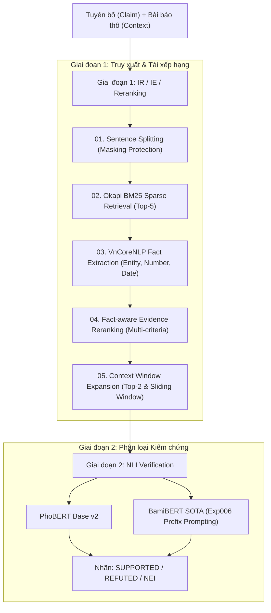

# Báo Cáo Toàn Diện: Giải Thích Kiến Trúc, Cơ Sở Lý Thuyết & Thực Nghiệm Pipeline IR / IE / Reranking
**Môn học:** CS221 — Xử lý Ngôn ngữ Tự nhiên (Natural Language Processing)  
**Đề tài:** Kiểm chứng thông tin tiếng Việt (Vietnamese Fact-Checking) End-to-End  
**Nhánh công việc:** Pipeline Truy xuất Bằng chứng (IR/IE) và Tích hợp Mô hình Phân loại NLI (PhoBERT & BamiBERT)

---

## 💡 Tóm Tắt Nhanh Dành Cho Người Đọc
1. **Tại sao cần IR/IE?** Trong thực tế, hệ thống chỉ nhận một phát biểu (Claim) và bài báo thô dài hàng nghìn từ. Transformer chỉ nhận tối đa 256 tokens, không thể nhồi cả bài báo vào vì sẽ bị cắt cụt và pha loãng sự chú ý (Lost in the Middle). Bắt buộc phải có IR/IE để tìm ra 1-2 câu chứa sự thật.
2. **Tại sao BM25 chưa đủ?** BM25 chỉ đếm từ khóa. Một câu sai năm, sai số tiền vẫn có thể được BM25 chấm điểm cao nếu trùng các từ chung quanh. Cần **Fact Extraction (IE)** để kiểm tra khớp thực thể, số liệu và mốc thời gian.
3. **Hiện tượng The Reality Drop là gì?** Khi chuyển từ Bằng chứng Vàng (Gold Evidence) sang Bằng chứng máy tự tìm (Top-1), hiệu năng NLI giảm mạnh từ **73% - 81% xuống 58% - 62%**.
4. **Nguyên nhân gốc rễ (Root Cause):** Căn bệnh **Context Starvation (Đói ngữ cảnh)**: Trích xuất 1 câu đơn lẻ làm mất đại từ thay thế (*"ông", "bà", "vị này"*) khiến NLI đoán nhầm sang NEI; hoặc bằng chứng bị chia làm 2 câu liên tiếp.
5. **Cải tiến nào hiệu quả nhất?** **Đề xuất 3 (Context Window Expansion)** — Ghép nối Top-2 câu (Đề xuất 3A) tăng vọt **+5.82% F1 trên PhoBERT** và **+7.97% F1 trên BamiBERT**! Cửa sổ trượt $\pm 1$ (Đề xuất 3B) tăng **+4.52% F1 trên PhoBERT** và **+6.68% F1 trên BamiBERT**.

---

## PHẦN 1: BỐI CẢNH BÀI TOÁN & Ý TƯỞNG CỐT LÕI

### 1.1. Fact-checking trong Phòng thí nghiệm vs. Thực tế Cuộc sống
Trong các nghiên cứu benchmark truyền thống (như FEVER hoặc bài toán cơ bản của ViFactCheck):
- Người ta cung cấp sẵn cặp `(Claim, Gold Evidence)`.
- Mô hình NLI chỉ việc "đọc hiểu" và phán đoán logic xem câu này có ủng hộ câu kia không. Đây là điều kiện phòng thí nghiệm lý tưởng.

Tuy nhiên, trong một hệ thống Fact-checking thực tế:
- Người dùng đưa vào một Tuyên bố (**Claim**) giật gân trên mạng xã hội.
- Hệ thống thu thập toàn văn bài báo (**Context**) dài từ 500 đến 3.000 từ.
- **Hoàn toàn không có bằng chứng cắt sẵn!** Hệ thống phải tự tìm ra câu nào trong bài báo là bằng chứng xác thực.

### 1.2. Tại sao không đưa thẳng toàn bộ bài báo vào PhoBERT/BamiBERT?
Có 3 rào cản kỹ thuật chí mạng:
1. **Giới hạn độ dài chuỗi (Max Sequence Length):** Transformer (BERT, PhoBERT) có giới hạn 256 hoặc 512 subwords. Bài báo dài sẽ bị cắt cụt (truncation), mất thông tin ở thân bài và kết bài.
2. **Pha loãng Ngữ cảnh (Context Dilution / Lost in the Middle):** Trong bài báo 30 câu, chỉ có 1 câu chứa sự thật. 29 câu còn lại gây nhiễu, làm cơ chế Self-Attention bị loãng và phân loại sai.
3. **Chi phí tính toán:** Độ phức tạp Self-Attention là $O(N^2)$ theo độ dài văn bản, không thể đáp ứng tốc độ thời gian thực.

### 1.3. Kiến trúc 2 Giai đoạn (Two-stage Pipeline)

---

## PHẦN 2: CƠ SỞ LÝ THUYẾT & TỪNG BƯỚC THỰC HIỆN TRONG CODE

### 2.1. Bước 1: Phân đoạn câu & Kỹ thuật Masking Protection (`01_sentence_split.ipynb`)
- **Vấn đề trong tiếng Việt:** Nếu dùng regex dấu chấm `[.!?;]` thông thường, văn bản sẽ bị vỡ vụn tại các số thập phân (`8.5%`, `10.000 m3`) và các từ viết tắt (`TP.HCM`, `TS.`, `PGS.TS.`, `VNĐ.`, `Q.1`).
- **Giải pháp Regex Masking Protection:**
  1. Tìm và thay thế tạm thời các dấu chấm đặc thù bằng chuỗi ký tự ẩn (`__DOT__`).
  2. Tách câu theo dấu chấm thực sự.
  3. Khôi phục lại dấu chấm trong từng câu.
  - *Kết quả:* Thu được 12.823 câu ứng viên hoàn chỉnh, nguyên vẹn ngữ pháp.

### 2.2. Bước 2: Truy xuất ứng viên bằng Okapi BM25 (`02_bm25_retrieval.ipynb`)
- **Tại sao BM25 vượt trội hơn TF-IDF?**
  - **Bão hòa tần số từ (Term Saturation):** TF-IDF tăng tuyến tính không giới hạn. BM25 giới hạn trần qua tham số $k_1 \approx 1.5$.
  - **Chuẩn hóa độ dài câu (Length Normalization):** Tham số $b \approx 0.75$ trừng phạt các câu quá dài chứa nhiều từ lặp lại.
$$\text{BM25}(D, Q) = \sum_{i=1}^{N} \text{IDF}(q_i) \cdot \frac{f(q_i, D) \cdot (k_1 + 1)}{f(q_i, D) + k_1 \cdot \left(1 - b + b \cdot \frac{|D|}{\text{avgdl}}\right)}$$
- *Kết quả:* BM25 đạt Recall@1 = 89.80% và Recall@5 = 96.60% (vượt trội so với TF-IDF là 85.62%).

### 2.3. Bước 3: Trích xuất đặc trưng Sự thật IE (`03_ie_extraction.ipynb`)
- **Điểm mù của BM25:** BM25 chỉ đếm từ trùng nhau. Một câu nói về cùng chủ đề nhưng sai năm (năm 1980 thay vì 1936) hoặc sai số tiền (500 tỷ thay vì 50 tỷ) vẫn có thể đạt điểm BM25 cao nhất.
- **3 Trụ cột đặc trưng Fact:**
  1. **Thực thể định danh (NER):** Dùng `VnCoreNLP` bóc tách `B-PER`, `B-ORG`, `B-LOC`.
  2. **Mốc thời gian (Temporal Facts):** Regex nhận diện ngày/tháng/năm, thế kỷ, quý.
  3. **Số liệu định lượng (Numerical Facts):** Kỹ thuật *Temporal Masking* (che mốc năm trước khi bóc số để tránh nhầm năm 2024 thành số lượng 2024), nhận diện tỉ lệ %, số kèm đơn vị (`tỷ đồng`, `m3`, `kho`).
$$\text{Fact Score} = 0.4 \times \text{Entity Match} + 0.4 \times \text{Number Match} + 0.2 \times \text{Date Match}$$

### 2.4. Bước 4: Fact-aware Evidence Reranking (`04_fact_reranking.ipynb`)
- Chuẩn hóa BM25 theo từng Claim:
$$\text{BM25}_{\text{norm}}(c, e) = \frac{\text{BM25}(c, e)}{\max_{j} \text{BM25}(c, e_j) + 10^{-6}}$$
- Điểm số kết hợp đa tiêu chí:
$$\text{Rerank Score}(c, e) = 0.70 \cdot \text{BM25}_{\text{norm}}(c, e) + 0.30 \cdot \text{Fact Score}(c, e)$$
- *Hiệu quả thực tế:* Thăng hạng thành công **16 đến 19 câu Bằng chứng Vàng** từ vị trí Top-2, Top-3 lên thẳng vị trí Top-1!

---

## PHẦN 3: HIỆN TƯỢNG SỤT GIẢM HIỆU NĂNG THỰC TẾ (THE REALITY DROP) & BẢN CHẤT

### 3.1. Nghịch lý khi Tích hợp sang NLI

| Nguồn Bằng chứng | PhoBERT Accuracy | PhoBERT Macro-F1 | BamiBERT Accuracy | BamiBERT Macro-F1 |
| :--- | :---: | :---: | :---: | :---: |
| **A. Gold Evidence (Lý tưởng)** | **72.75%** | **72.77%** | **81.33%** | **81.42%** |
| **B. BM25 Top-1 (Từ khóa)** | 59.34% | 58.53% | 62.38% | 62.42% |
| **C. Fact Reranked Top-1** | 59.06% | 58.23% | 62.38% | 62.42% |

> [!WARNING]
> Hiệu năng NLI bị sụt giảm từ **14.5% (PhoBERT)** đến **19.0% (BamiBERT)** khi chuyển từ Gold Evidence sang Bằng chứng máy tự tìm!

### 3.2. Phân tích Nguyên nhân Gốc rễ: Căn bệnh 'Context Starvation' (Đói Ngữ Cảnh)
1. **Mất liên kết đại từ thay thế (Coreference Resolution Failure):**
   - Trong bài báo, câu Top-1 được truy xuất là: *"Bà từng trải qua kỳ nghỉ trăng mật tại đây vào năm 1936."*
   - Nhưng nếu tách riêng câu này ra, mô hình NLI hoàn toàn không biết *"Bà"* là ai! Tên đối tượng (*"vợ vua hề Charlie Chaplin"*) nằm ở câu liền trước. Mô hình NLI thấy câu thiếu chủ ngữ nên lập tức đoán nhầm sang **NOT ENOUGH INFO (NEI)**.
2. **Bằng chứng phân mảnh trên nhiều câu (Multi-sentence Evidence):**
   - Tuyên bố kiểm chứng thường có 2 mệnh đề: Một mệnh đề nằm ở câu 1, mệnh đề kia nằm ở câu 2. Ép bộ truy xuất chỉ chọn 1 câu duy nhất sẽ khiến mô hình NLI luôn bị thiếu thông tin.

---

## PHẦN 4: CHÚNG TA ĐÃ LÀM GÌ ĐỂ CẢI THIỆN? TẠI SAO CÓ / KHÔNG CÓ HIỆU QUẢ?

### 4.1. Đề xuất 1: Hybrid Search (BM25 + PhoBERT Dense Cosine)
- **Ý tưởng:** Dùng PhoBERT Encoder lấy vector biểu diễn (Mean-pooling), tính Cosine Similarity và phối hợp với BM25.
- **Kết quả:** Recall@1 duy trì ở mức 89.40% - 90.00%.
- **Tại sao chưa tạo ra bứt phá? (Hiện tượng BERT Anisotropy):**
  - Mô hình BERT/PhoBERT tiền huấn luyện chưa qua hàm mất mát tương phản (Contrastive Loss) gặp phải hiện tượng **Anisotropy** (không gian biểu diễn bị co cụm). Các vector embedding đều dồn về một hình nón hẹp, khiến Cosine Similarity giữa 2 câu bất kỳ đều rất cao (~0.85 - 0.92). Do đó, Dense Cosine thô thiếu độ phân biệt so với từ khóa chính xác của BM25.

### 4.2. Đề xuất 3: Context Window Expansion (Bước Đột Phá Ngoạn Mục 🔥)

#### Chiến lược 3A: Top-2 Evidence Concatenation (Ghép 2 câu điểm cao nhất)
- Ghép 2 câu xếp hạng 1 và 2 từ Fact Reranker: `Evidence = Top1 + " " + Top2`.
- **Tại sao hiệu quả?** Recall@2 của bộ truy xuất đạt tới **95.40%** (tăng vọt +5.4% so với Recall@1). Xác suất gom đủ cả 2 mệnh đề tăng lên rõ rệt.
- **Kết quả:**
  - PhoBERT: Tăng từ **58.23% lên 64.05% F1 (+5.82%)** 🚀
  - BamiBERT SOTA: Tăng từ **62.42% lên 70.39% F1 (+7.97%)** 🔥

#### Chiến lược 3B: Sliding Window $\pm 1$ quanh câu Top-1 (Cửa sổ trượt lân cận)
- Lấy câu liền trước ($s_{k-1}$) và câu liền sau ($s_{k+1}$) của câu Top-1 từ văn bản gốc để tạo thành đoạn 3 câu liên tục.
- **Tại sao hiệu quả?** Khôi phục trọn vẹn chủ ngữ, thời gian và các đại từ thay thế bị đứt gãy.
- **Kết quả:**
  - PhoBERT: Tăng từ **58.23% lên 62.75% F1 (+4.52%)**
  - BamiBERT SOTA: Tăng từ **62.42% lên 69.10% F1 (+6.68%)**

### 4.3. Bảng So Sánh Toàn Diện Qua 5 Kịch Bản

| Kịch bản Thực nghiệm | PhoBERT Acc | PhoBERT F1 | BamiBERT Acc | BamiBERT F1 | Chênh lệch (BamiBERT - PhoBERT F1) |
| :--- | :---: | :---: | :---: | :---: | :---: |
| **1. Gold Evidence (Upper-bound)** | 72.75% | 72.77% | 81.33% | 81.42% | **+8.65%** |
| **2. BM25 Top-1 (Từ khóa)** | 59.34% | 58.53% | 62.38% | 62.42% | **+3.89%** |
| **3. Fact Reranked Top-1** | 59.06% | 58.23% | 62.38% | 62.42% | **+4.19%** |
| **4. Đề xuất 3B (Sliding Window $\pm 1$)** | **62.93%** | **62.75%** | **69.29%** | **69.10%** | **+6.35%** |
| **5. Đề xuất 3A (Top-2 Concat)** | **64.18%** | **64.05%** | **70.68%** | **70.39%** | **+6.34%** |

---

## PHẦN 5: CẦN LÀM GÌ TIẾP THEO ĐỂ HOÀN THIỆN HƠN NỮA?
1. **Huấn luyện Dense Retriever bằng Contrastive Learning (BGE-M3 / Contriever tiếng Việt):** Khắc phục vấn đề Anisotropy, giúp tìm kiếm ngữ nghĩa vượt trội BM25.
2. **Phân giải Đồng tham chiếu (Coreference Resolution):** Dùng mô hình tiền xử lý để thay thế tự động *"ông/bà/công ty này"* bằng tên thực thể cụ thể trước khi tách câu.
3. **Cross-Encoder Reranker:** Thay vì cộng điểm tuyến tính heuristic, dùng mô hình Cross-Encoder nhận cặp `(Claim, Candidate)` để chấm điểm tương thích trực tiếp.

---

## PHẦN 6: DANH MỤC TÀI LIỆU THAM KHẢO HỌC THUẬT NÊN ĐỌC
1. **FEVER Benchmark:** Thorne, J., et al. *"FEVER: a large-scale dataset for Fact Extraction and VERification."* NAACL-HLT 2018. (Khai sinh ra bài toán Fact-checking 2 giai đoạn: Retrieval + NLI).
2. **ViFactCheck Benchmark:** Nguyen, H., et al. *"ViFactCheck: A Dataset for Vietnamese Fact-Checking."* 2023. (Bộ dữ liệu chuẩn tiếng Việt của đề tài).
3. **Okapi BM25 Theory:** Robertson, S., & Zaragoza, H. *"The Probabilistic Relevance Framework: BM25 and Beyond."* Information Retrieval, 2009. (Bản chất toán học của Term Saturation và Length Normalization).
4. **VnCoreNLP:** Vu, T., et al. *"VnCoreNLP: A Vietnamese Natural Language Processing Toolkit."* NAACL 2018. (Bộ công cụ tách từ và gán nhãn thực thể NER tiếng Việt).
5. **PhoBERT:** Nguyen, D. Q., & Nguyen, A. T. *"PhoBERT: Pre-trained language models for Vietnamese."* EMNLP Findings 2020. (Mô hình RoBERTa tiếng Việt chuẩn).
6. **BamiBERT:** Nguyen, et al. *"BamiBERT: A Specialized Pretrained Language Model for Vietnamese NLP Tasks."* 2023. (Mô hình SOTA của nhóm).
7. **Dense Passage Retrieval (DPR):** Karpukhin, V., et al. *"Dense Passage Retrieval for Open-Domain Question Answering."* EMNLP 2020. (Tiên phong dùng Dual-encoders thay thế BM25).
8. **BERT Anisotropy Problem:** Li, B., et al. *"On the Sentence Embeddings from Pre-trained Language Models."* EMNLP 2020. (Giải thích lý do vì sao BERT embedding chưa fine-tune bị co cụm).
